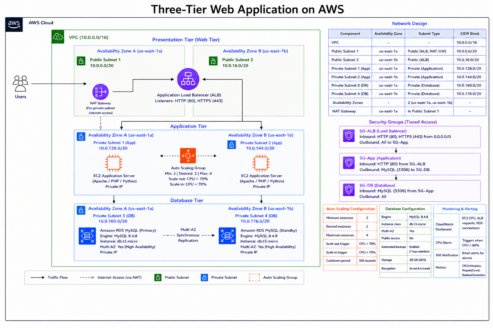
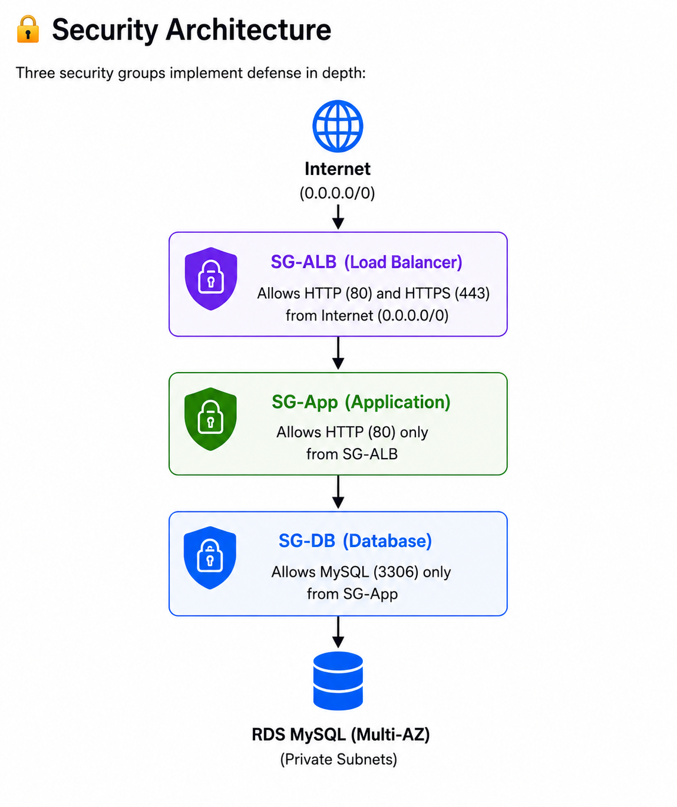

# AWS Three-Tier Web Application

## Why I built this

I wanted to get hands-on with AWS networking and understand how VPC, EC2, load balancers and RDS actually work together. I had done some theory but never built a full three-tier setup from scratch, so this was my attempt at doing that.

Took me a few days to get everything working properly — ran into some issues along the way which I've documented below.

---

## What I built

- Custom VPC with 6 subnets across 2 availability zones (us-east-1a and us-east-1b)
- EC2 instances running Apache in private subnets
- Application Load Balancer in public subnets to handle incoming traffic
- Auto Scaling Group to keep at least 2 instances running
- RDS MySQL database in private DB subnets with Multi-AZ enabled
- Session Manager instead of SSH to connect to private instances

---

## Architecture


---

## Security groups setup



I created 3 separate security groups and chained them:

```
Internet → SG-ALB (port 80) → SG-App (port 80) → SG-DB (port 3306)
```

SG-App only accepts traffic from SG-ALB. SG-DB only accepts traffic from SG-App. So the database has no direct path from the internet.

---

## Services used

| Service | How I used it |
|---------|--------------|
| Amazon VPC | Created using "VPC and more" wizard — 10.0.0.0/16, 2 AZs, 1 NAT Gateway |
| Amazon EC2 | t2.micro, Amazon Linux 2023, Apache via user data |
| EC2 Auto Scaling | Min 2 / Desired 2 / Max 4, CPU target 70% |
| Application Load Balancer | Internet-facing, public subnets, manually created |
| Amazon RDS MySQL | MySQL 8.4.8, db.t3.micro, Multi-AZ, private subnets |
| Security Groups | 3 groups chained — ALB → App → DB |
| NAT Gateway | 1 in public subnet (only 1 to save cost) |
| CloudWatch | CPU alarm at 80%, dashboard for EC2/ALB/RDS metrics |
| SNS | Email alert when CPU alarm fires |
| IAM | EC2-SSM-Role with AmazonSSMManagedInstanceCore |
| Systems Manager | Session Manager to SSH into private EC2 without port 22 |

---

## Network layout

| Subnet | AZ | Used for |
|--------|----|----------|
| Public Subnet 1 | us-east-1a | ALB + NAT Gateway |
| Public Subnet 2 | us-east-1b | ALB |
| Private Subnet 1 | us-east-1a | EC2 app servers |
| Private Subnet 2 | us-east-1b | EC2 app servers |
| Private Subnet 3 | us-east-1a | RDS primary |
| Private Subnet 4 | us-east-1b | RDS standby |

---

## Database config

- Engine: MySQL 8.4.8
- Instance: db.t3.micro
- Multi-AZ: yes (standby created automatically in us-east-1b)
- Public access: no
- Backups: enabled

---

## How I set it up

**VPC** — used the "VPC and more" wizard which handles the IGW, NAT Gateway and route tables automatically. I then manually added 2 extra private subnets for RDS since the wizard only gives you public + private.

**Security groups** — created SG-ALB, SG-App and SG-DB. Made sure each one only allows traffic from the one above it in the chain.

**RDS** — had to create a DB Subnet Group first with subnets from both AZs before I could enable Multi-AZ. Took me a minute to figure out why Multi-AZ was failing.

**IAM role** — created EC2-SSM-Role before launching EC2. Forgot to do this the first time and Session Manager wouldn't connect (see challenge 2).

**Launch Template** — AL2023, t2.micro, Apache user data:

```bash
#!/bin/bash
yum update -y
dnf install -y httpd
systemctl start httpd
systemctl enable httpd
echo "<h1>Hello from $(hostname -f)</h1>" > /var/www/html/index.html
```

**ALB** — created this manually before creating the ASG. Important — do not let ASG auto-create it (see challenge 1).

**ASG** — Min 2 / Desired 2 / Max 4, attached to the ALB target group, CPU target tracking at 70%.

**Monitoring** — CloudWatch alarm when CPU > 80%, SNS email notification. Tested it and the email came through.

---

## Problems I ran into

### Problem 1 — All targets showing Unhealthy, ALB returning 502

When I created the ASG I let it auto-create the load balancer. What I didn't realise was that AWS attached SG-App to the ALB instead of SG-ALB. So the security group chain was broken from the start.

Spent a while checking the wrong things — Apache logs, route tables, SG-App rules. Everything looked fine. Eventually checked the ALB Security tab and that's when I saw the wrong SG was attached.

Fixed it by going to the ALB → Security tab → Edit security groups → swapped SG-App for SG-ALB → saved. Took about 2-3 mins for the health checks to go green.

Lesson: always create the ALB manually so you can pick the right security group yourself.

---

### Problem 2 — Session Manager throwing AccessDeniedException

Tried to connect to private EC2 via Session Manager and got:
`SSM Agent unable to acquire credentials — AccessDeniedException`

The EC2 had no IAM role attached so the SSM Agent couldn't authenticate with Systems Manager.

Fixed it by:
1. Creating EC2-SSM-Role in IAM with AmazonSSMManagedInstanceCore policy
2. Going to EC2 → Actions → Security → Modify IAM role → attached EC2-SSM-Role
3. Waited a few minutes and Session Manager worked

I should have created the IAM role before launching the instance — would have saved some time.

---

### Problem 3 — mysql package not found

After connecting to the EC2 I tried installing the MySQL client to test the RDS connection:

```bash
sudo yum install -y mysql
# No match for argument: mysql

sudo dnf install -y mysql
# also failed
```

The instance was running Amazon Linux 2023, not AL2. AL2023 doesn't have a `mysql` package in its default repo.

The correct package for AL2023 is:

```bash
sudo dnf install -y mariadb105
```

After that connected to RDS fine:

```bash
mysql -h project-db.cu5ou4mmuxe2.us-east-1.rds.amazonaws.com -u admin -p
```

Got the MariaDB monitor prompt. Ran `show databases;` and created a test database to confirm it was working.

---

## Monitoring

Set up a CloudWatch dashboard showing EC2 CPU, ALB request count and RDS connections. Also created a CPU alarm that fires at 80% and sends an SNS email. Tested it and confirmed the notification came through.

---

## Rough cost breakdown

| Resource | Approx monthly cost |
|----------|-------------------|
| EC2 t2.micro x2 | Free tier |
| RDS db.t3.micro Multi-AZ | ~$25–50 |
| NAT Gateway | ~$32 |
| ALB | ~$16 |

RDS and NAT Gateway charge even when idle so make sure to delete everything after testing.

---

## What I learned

Building this project made me understand how real applications are isolated from the internet at the network level.
Every major application we use — banking, e-commerce, healthcare — has its database sitting in a completely private network with no direct path from the internet. You can never reach it directly. The only way in is through the application layer, and the only way into the application layer is through the load balancer. Each layer only talks to the one directly above it. Nothing else gets through.
That is exactly what the security group chain does here. SG-ALB only accepts traffic from the internet. SG-App only accepts traffic from SG-ALB. SG-DB only accepts traffic from SG-App. If you try to reach the database directly from the internet there is no path. It does not exist at the network level.
I only fully understood this when the wrong security group on the ALB silently broke the entire chain. Everything looked fine — Apache was running, route tables were correct, EC2 was healthy. But the chain was broken at the first link so nothing worked. That one mistake taught me more about how layered network security actually works than anything else.
---

## Author

**Muralidharan M N**

AWS Certified Cloud Practitioner | AWS re/Start Graduate

LinkedIn: https://www.linkedin.com/in/muralidharan-m-n-78a2522b8

GitHub: https://github.com/muralidharan666666-dev
